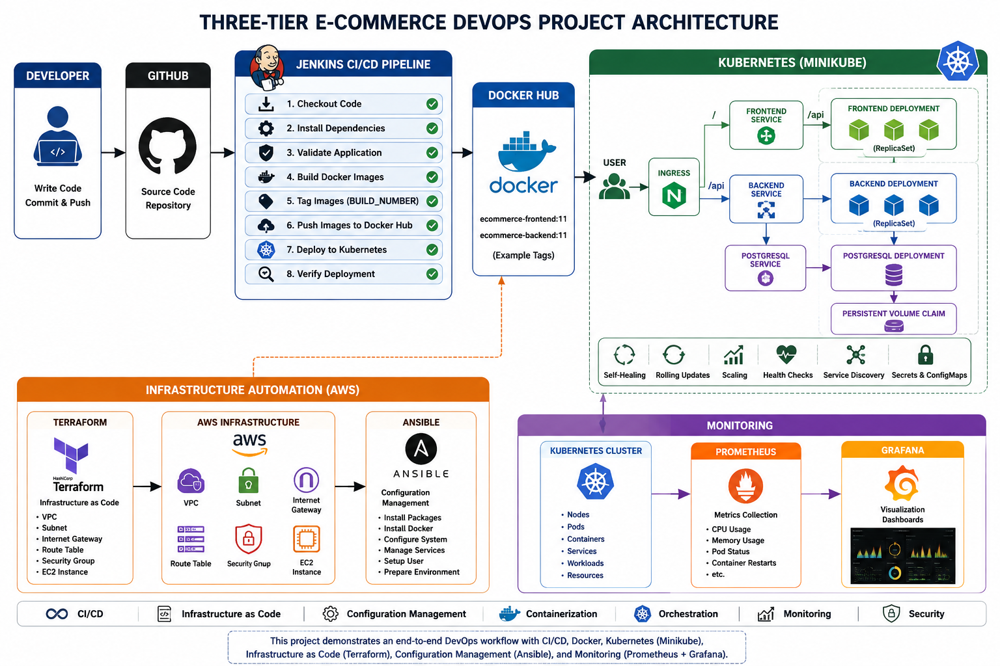
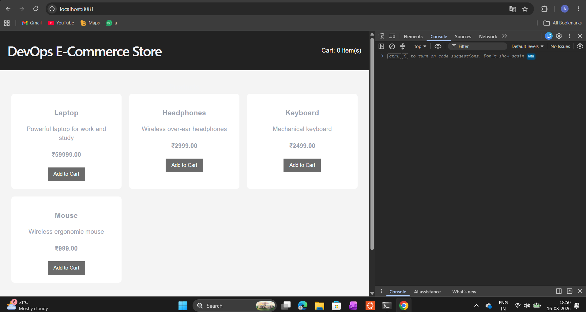
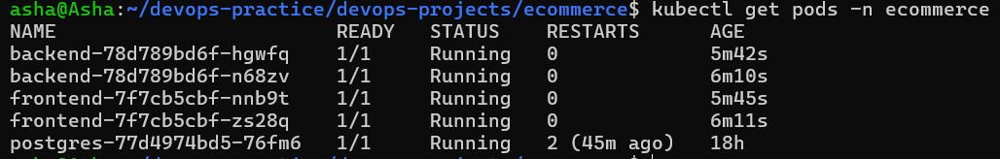
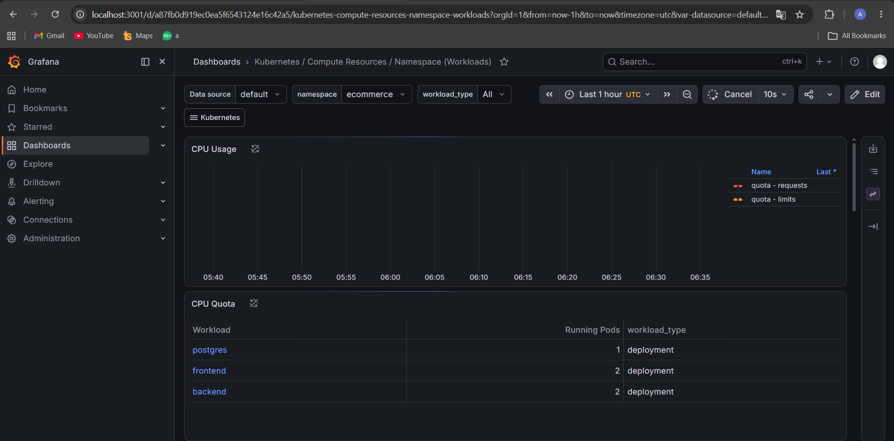

# Three-Tier E-Commerce DevOps Project

## Overview

This project demonstrates an end-to-end DevOps workflow for a three-tier E-Commerce application.

The application consists of:

- Frontend — React
- Backend — Node.js / Express
- Database — PostgreSQL

The main goal of this project was not application development, but to implement a complete DevOps workflow around the application using CI/CD, containerization, infrastructure automation, configuration management, Kubernetes orchestration, and monitoring.

---

# Architecture



```text
Developer
    |
    v
GitHub
    |
    v
Jenkins CI/CD
    |
    +---- Application Validation
    |
    +---- Docker Build
    |
    +---- Image Tagging
    |
    v
Docker Hub
    |
    v
Kubernetes
    |
    +-----------------------------+
    |                             |
    v                             v
Frontend                      Backend
Deployment                    Deployment
    |                             |
    v                             v
Frontend Service             Backend Service
                                  |
                                  v
                           PostgreSQL Service
                                  |
                                  v
                              PostgreSQL
                                  |
                                  v
                         Persistent Storage

User
 |
 v
Ingress
 |
 +------ / ------> Frontend
 |
 +------ /api ---> Backend


Monitoring:

Kubernetes
    |
    v
Prometheus
    |
    v
Grafana


Infrastructure Automation:

Terraform
    |
    v
AWS Infrastructure
    |
    v
EC2
    |
    v
Ansible
    |
    v
Server Configuration
```

---

# Technologies Used

## DevOps

- Git
- GitHub
- Jenkins
- Docker
- Docker Compose
- Kubernetes
- Helm
- Terraform
- Ansible
- Prometheus
- Grafana

## Cloud

- AWS
- EC2
- VPC
- Subnets
- Internet Gateway
- Route Tables
- Security Groups

## Application

- React
- Node.js
- Express
- PostgreSQL
- Nginx

## Environment

- Windows 11
- WSL2
- Ubuntu
- Minikube

---

# Project Structure

```text
ecommerce/
|
├── frontend/
|   ├── Dockerfile
|   ├── package.json
|   └── src/
|
├── backend/
|   ├── Dockerfile
|   ├── package.json
|   └── server.js
|
├── database/
|   └── init.sql
|
├── terraform/
|   ├── providers.tf
|   ├── main.tf
|   ├── variables.tf
|   └── outputs.tf
|
├── ansible/
|   ├── inventory.ini
|   ├── ansible.cfg
|   └── site.yml
|
├── kubernetes/
|   ├── namespace.yaml
|   ├── configmap.yaml
|   ├── postgres-pvc.yaml
|   ├── postgres-deployment.yaml
|   ├── postgres-service.yaml
|   ├── backend-deployment.yaml
|   ├── backend-service.yaml
|   ├── frontend-deployment.yaml
|   ├── frontend-service.yaml
|   └── ingress.yaml
|
├── Jenkinsfile
├── docker-compose.yml
├── .gitignore
└── README.md
```

---

# Docker

The frontend and backend applications are containerized using Docker.

The frontend uses a multi-stage Docker build:

```text
Node.js Build Stage
        |
        v
React Production Build
        |
        v
Nginx Runtime Image
```

The backend runs as a Node.js container.

PostgreSQL uses the official PostgreSQL Docker image.

Docker Compose is used to run the complete application locally.

```bash
docker compose up -d
```

This starts:

```text
Frontend
Backend
PostgreSQL
```

---

# Jenkins CI/CD Pipeline

Jenkins automates the CI/CD workflow.

Pipeline flow:

```text
Git Push
    |
    v
Jenkins
    |
    v
Checkout
    |
    v
Install Dependencies
    |
    v
Validate Application
    |
    v
Build Docker Images
    |
    v
Tag Images with BUILD_NUMBER
    |
    v
Push Images to Docker Hub
    |
    v
Update Kubernetes Deployments
    |
    v
Rolling Deployment
```

Docker images are versioned using the Jenkins build number.

Example:

```text
ecommerce-frontend:11
ecommerce-backend:11
```

This provides build traceability and makes deployment versions easy to identify.

---

# Kubernetes Deployment

The application is deployed on Kubernetes using Minikube for local orchestration and CI/CD validation.

The Kubernetes implementation includes:

- Namespace
- Deployments
- Services
- ConfigMaps
- Secrets
- PersistentVolumeClaim
- Ingress
- Readiness probes
- Liveness probes
- Multiple application replicas
- Rolling updates
- Rollback
- Self-healing

Application architecture:

```text
Ingress
   |
   +---- / ----> Frontend Service
   |                  |
   |                  v
   |             Frontend Pods
   |
   +---- /api -> Backend Service
                      |
                      v
                 Backend Pods
                      |
                      v
              PostgreSQL Service
                      |
                      v
                 PostgreSQL
                      |
                      v
              Persistent Storage
```

The frontend and backend run with multiple replicas to demonstrate Kubernetes scaling and self-healing.

---

# Terraform and AWS

Terraform is used to provision AWS infrastructure using Infrastructure as Code.

Resources include:

- VPC
- Public Subnet
- Internet Gateway
- Route Table
- Security Group
- EC2 Instance

Terraform workflow:

```text
terraform init
      |
terraform validate
      |
terraform plan
      |
terraform apply
```

This demonstrates repeatable infrastructure provisioning instead of manually creating resources through the AWS Console.

---

# Ansible

Ansible is used to configure the AWS EC2 instance after Terraform provisions the infrastructure.

Configuration tasks include:

- Package installation
- Git installation
- Docker installation
- Docker service management
- User permissions
- Application directory creation

Architecture:

```text
Terraform
    |
    v
Create EC2
    |
    v
Ansible
    |
    v
Configure EC2
```

This separates infrastructure provisioning from server configuration.

---

# Monitoring

Prometheus and Grafana are deployed using Helm.

```text
Kubernetes
    |
    v
Prometheus
    |
    v
Grafana
    |
    v
Dashboards
```

Monitoring includes visibility into:

- Kubernetes nodes
- Namespaces
- Pods
- Containers
- CPU usage
- Memory usage
- Container restarts
- Workload health

The `ecommerce` namespace is monitored through Grafana Kubernetes dashboards.

---

# Security Practices

The project follows basic DevOps security practices.

Sensitive files are excluded from Git using `.gitignore`.

Examples include:

```text
.env
terraform.tfstate
terraform.tfvars
kubernetes/secret.yaml
SSH private keys
```

Docker Hub credentials are stored in Jenkins Credentials rather than directly inside the Jenkinsfile.

Kubernetes Secrets are used for sensitive application configuration.

AWS credentials are configured locally and are not stored in the Terraform configuration.

---

# Key DevOps Concepts Demonstrated

This project demonstrates:

- Infrastructure as Code
- Configuration Management
- Continuous Integration
- Continuous Deployment
- Pipeline as Code
- Containerization
- Container Orchestration
- Service Discovery
- Persistent Storage
- Secret Management
- Health Checks
- Self-Healing
- Horizontal Scaling
- Rolling Updates
- Rollbacks
- Infrastructure Monitoring
- Build Versioning

---

# CI/CD Result

A source-code change follows this automated workflow:

```text
Developer changes code
        |
        v
Git Push
        |
        v
GitHub
        |
        v
Jenkins automatically detects change
        |
        v
Application validation
        |
        v
Docker image build
        |
        v
Docker Hub push
        |
        v
Kubernetes deployment update
        |
        v
Rolling update
        |
        v
New application version running
```

---

# Local Application Access

Because Kubernetes is running through Minikube inside WSL2, local access is provided through port forwarding.

```bash
kubectl port-forward \
-n ingress-nginx \
service/ingress-nginx-controller \
8081:80
```

Application:

```text
http://localhost:8081
```

Prometheus:

```bash
kubectl port-forward \
-n monitoring \
svc/monitoring-kube-prometheus-prometheus \
9090:9090
```

Grafana:

```bash
kubectl port-forward \
-n monitoring \
svc/monitoring-grafana \
3001:80
```

Port forwarding is used only for the local Minikube lab environment.

In a production cloud Kubernetes environment, external traffic would normally be exposed through an appropriate load balancer, Ingress, and DNS configuration.

---

# Project Outcome

This project provided hands-on experience building an end-to-end DevOps workflow around a three-tier application.

It combines:

```text
Source Control
     +
CI/CD
     +
Containers
     +
Kubernetes
     +
Infrastructure as Code
     +
Configuration Management
     +
Cloud
     +
Monitoring
```

The project demonstrates how different DevOps tools work together rather than using each technology as an isolated lab.

# Project Demo

## E-Commerce Application



## Kubernetes Deployment



## Monitoring with Grafana


